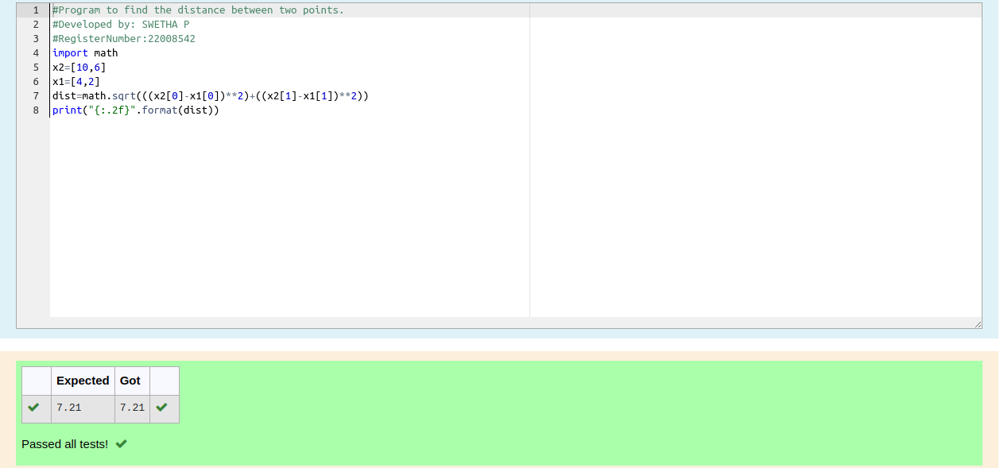

# DISTANCE-BETWEEN-TWO-POINTS

## AIM:

To write a python program to find the distance two 2 points

## ALGORITHM:

### Step 1: 
Import math
### Step 2: 
Get the inputs
### Step 3: 
Substitute the values in the distance formula  
### Step 4: 
Print the final output
### Step 5: 
End the program

### 
PROGRAM:
```python
#Program to find the distance between two points.
#Developed by: SWETHA P
#RegisterNumber:22008542
import math
x2=[10,6]
x1=[4,2]
dist=math.sqrt(((x2[0]-x1[0])**2)+((x2[1]-x1[1])**2))
print("{:.2f}".format(dist))
```

### OUTPUT:



### RESULT:
Thus the distance between the two points are found
